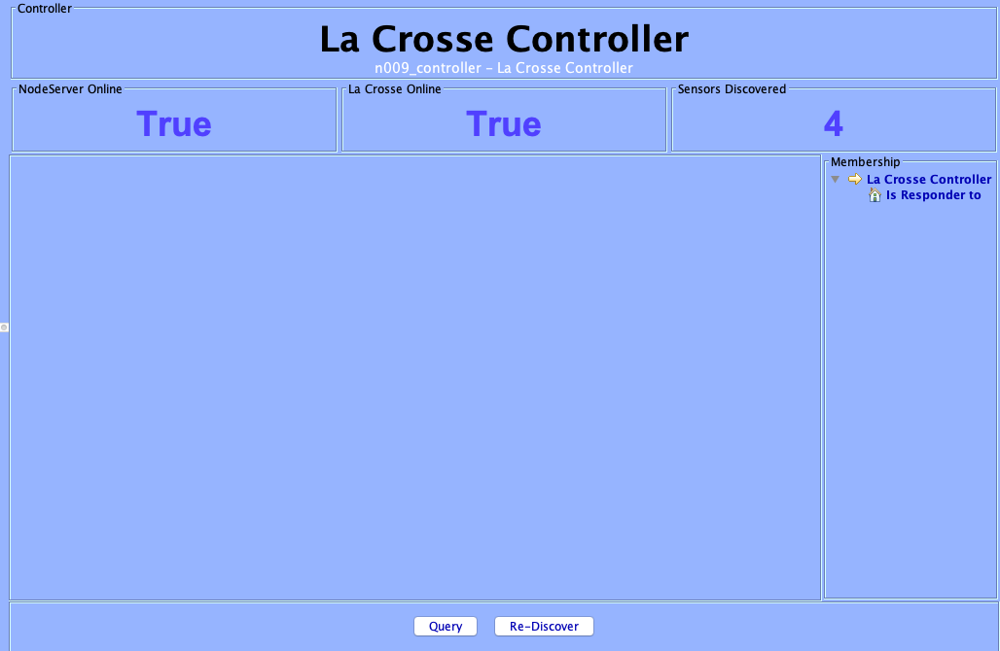
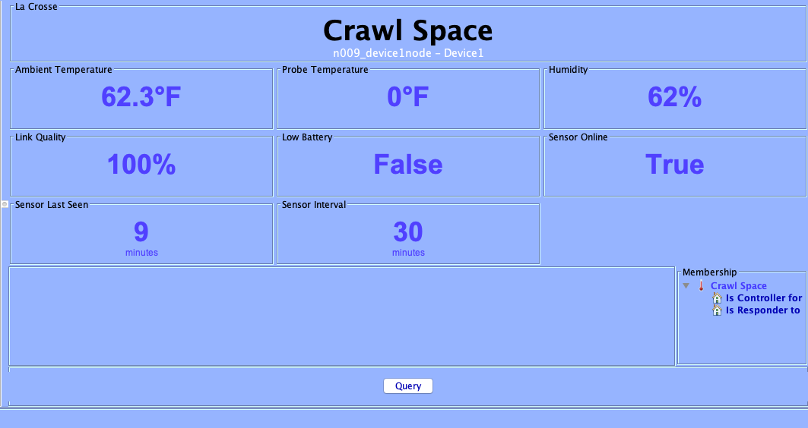

# MyNodeServer
La Crosse Alerts Poly NodeServer for Polyglot v2 written in Python2/3
by Parker Smith (psmith3) parker@parker3.com.

UDI Polyglot V2 Integration of La Crosse Alerts from wireless temperature & humidity sensors and allows monitoring of
1 gateway and up to 5 sensors. ISY integration provides:

<b>Ambient Temperature</b>

<b>Probe Temperature</b>

<b>Relative Humidity</b>

<b>Time Last Seen in minutes</b>

<b>Gateway & sensor online status</b>

<b>RF Link Quality</b>

<b>Low Battery Alerts</b>

Set alerts for any available attributes such as low battery, connection loss, and min / max alerts for temperature and humidity.
No subscription required and data is pulled from API for Basic Lifetime subscription included with La Crosse devices
