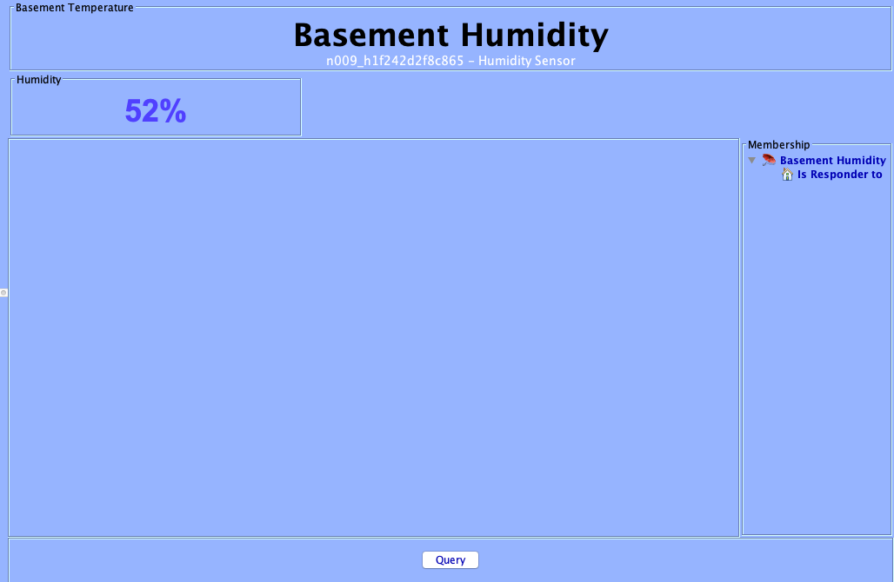
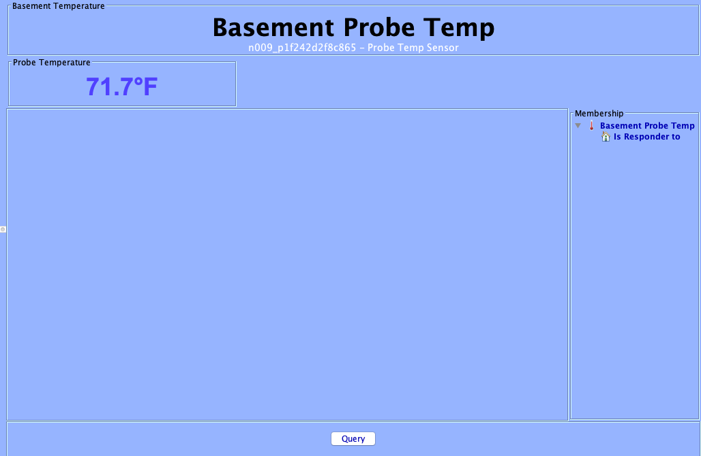
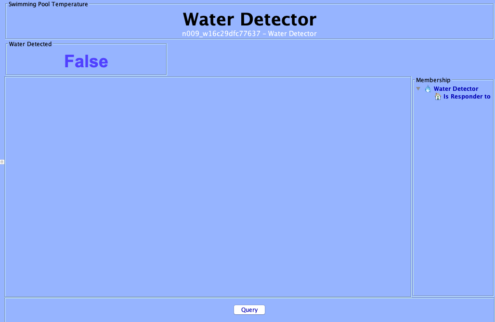
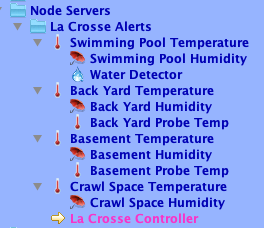

# MyNodeServer
La Crosse Alerts Poly NodeServer for Polyglot v2 written in Python2/3
by Parker Smith (psmith3)

UDI Polyglot V2 Integration of La Crosse Alerts from wireless temperature/humidity and water leak sensors.

Version 2.0.0 adds the ability to discover multiple gateways and sensors on a user's La Crosse Alerts Mobile account.
- Dynamically discovers gateways and sensors in user account.
- Creates nodes for Ambient Temp, Probe Temp, Humidity, and Water Detector.
- Ambient Temp node displays Battery Status, Sensor Online Status, Gateway Association and Online Status, Sensor last seen in Minutes, Gateway last seen in Minutes, RF Link Quality and Reported Sensor Check-in Interval.
- Ability to set Sensor Interval to 5, 10, 15, 30, 45 & 60 minutes.

Set alerts in ISY for any available attributes such as low battery, connection loss, min/max alerts for temperature and humidity, and water leaks.

No subscription required and data is pulled from API for Basic Lifetime subscription included with La Crosse devices.
